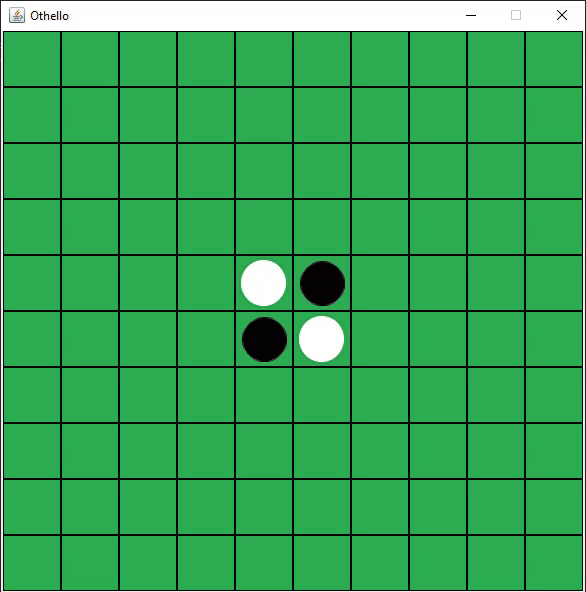

Othello Game



This repository contains code for the Othello game. It provides the interface for each player to program game logic, and then for players to be pitted against each other. There are two kinds of matches:

1. A 1v1 versus match, or
2. a round-robin championship where each player faces off against every other player, and the winner is the one with the most victories.

## Installing

The code requires `python=3.9 numpy`. You can `pip install` or `conda install` these packages. It is recommended to use a virtual environment.

## Interface

This repository provides the `Player` class which includes their game logic. It is in turn used by the `OthelloBoard` class to run the game.

The `Player` class has two methods which may be overridden:

1. `setup()` is called at the beginning of the game, and may be used to set up any game logic (loading stuff etc.). It is a timed method, and taking too long will cause the player to lose by default.
2. `play(self, board: np.ndarray) -> (int, int)` takes the current state of the board, and returns a tuple of the int as (row_index, column_index) corresponding to the coordinated of the chosen move. If the number of the invalid moves exceeds some amounts, the player loses by default. The maximum number of the invalid moves may change in the future. You  must make sure that your agent always provides valid move to the program. If in some situation you don't have any moves to play, you should return None instead of a coordinate. If you don't have a legal move and you provide a move to the game, you'll loose. 

When writing up your player, you may subclass the `Player` class, or write your own, but with these method signatures.

The `OthelloBoard` class plays matches between two players. It has the `play(p1, p2) -> str, str, list[int]` method that returns the winner, reason for win, and the list of moves as a list of tuples.

`player1`, `player2` are the string names of the modules containing the player object.

* If you have your own `Player` class in a file `myplayer.py` in the working directory, you can simply pass `myplayer`.
* If your player is named something else, then specify the class name like `myplayer/Playa`
* If the player is in a nested module. For example if you'd need to write `from players.simple import Dumbo`, then specify the player as `players.simple/Dumbo`.

## Testing your player

First, write your player code. You can either:

1. Edit the definition in the [`player.py`][1] file
2. Make a new python module and implement the `Player` interface. You can implement different players and test them against each other yourself.

```python
import numpy as np

from player import Player as BasePlayer


# The class named Player will be imported as default, unless another class name
# is provided as part of the argument to OthelloBoard.play()
class Player(BasePlayer):
    def setup():
        print('setting up')
    def play(board):
        print(
            'board is a numpy array: %s or shape %s' % \
            (isinstance(board, np.ndarray, board.shape))
        )
        # must return a valid column index
        return 1


# When using the script, if a class name is not provided, by default only
# the class named `Player` will be imported, one per module.
class AnotherPlayer(BasePlayer):
    def setup():
        pass
    def play(board):
        pass

# The class does not need to inherit from the player.Player class, as long as 
# the two methods are implemented.
class StrongIndependentPlayer:
    def setup():
        pass
    def play(board: np.ndarray):
        return (0, 0)
```

There are several ways to test play.

### Using the `OthelloBoard` class

```python
from othello import OthelloBoard

game = OthelloBoard()

# See above on how to sppecify player names as strings.
winner, reason, moves = game.play(Player1, Player2)

print(game)
```

### Using the script

```bash
> python othello.py --help

usage: Othello Game [-h] [-v P1 P2] [-c DIRECTORY [DIRECTORY ...]]

Play Othello between two players.

optional arguments:
  -h, --help            show this help message and exit
  -v P1 P2, --versus P1 P2
                        Play one game between two players. Specify players as `MODULE.PATH/CLASSNAME` or `MODULE.PATH` where the default `Player` class is used. For e.g.   
                        `dummies/LazyBoi`, or `dummies` (which will use the `dummies.Player` class.
  -c DIRECTORY [DIRECTORY ...], --championship DIRECTORY [DIRECTORY ...]
                        Specify directory containing player modules/packages, OR list of player modules/packages. Each player plays against every other player. If directory
                        given, each module/package should implement the default `Player` class.
  -n NUM, --num NUM     Number of games to play for a pair in a championship.
  --rows ROWS           Number of rows in game board.
  --columns COLUMNS     Number of columns in game board.
  
  --timeout_move TIMEOUT_MOVE
                        Time alotted per player move.
  --timeout_setup TIMEOUT_SETUP
                        Time alotted for setup before each game.
  --max_invalid_moves MAX_INVALID_MOVES
                        Max invalid moves before forfeiting the game.

# Championships: The following code will run all of the players inside of the arena against eachother.
> python othello.py -c arena 


# Versus games

# if the players are placed in the arena folder
> python othello.py -v arena.dummies3 arena.dummies2

# if the players are placed in the main directory
> python othello.py -v dummies/SmartRandom dummies/SmartRandom


```

## Playing with others

1. Clone this repository and install dependencies,
2. Each player should be defined in a python module (single file) or a package (directory) from which the player class can be imported.
3. Put your player files in the 'arena' directory (or any other directory under othello/). 

4. The default player class is named Player. This will be automatically imported. If you have named your player class something else, you’ll need to provide it to the command line script.

5. Now you can run the two players against each other. Let’s say the players are named as shown above. From the othello/ working directory, you can run:

```
    python othello.py -v player_arena.player_vunetid_a player_arena.player_vunetid_b
```

And it will run the two players against each other.

If you have custom class names:

    python othello.py -v player_arena.player_vunetid_a/CLASSNAME player_arena.player_vunetid_b/CLASSNAME
                
If you want to run a championship of all players in the directory, where each player plays against every one else:

    python othello.py -c player_arena

---

For questions, email me at ali.abbasi@vanderbilt.edu or visit the office hours on Mondays and Wednesdays from 10:30 to 12:00

[1]: /player.py
